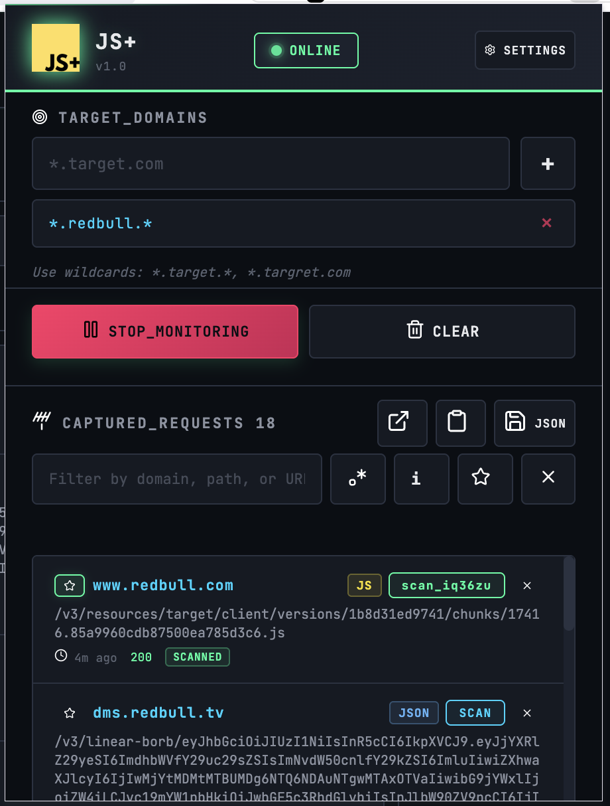
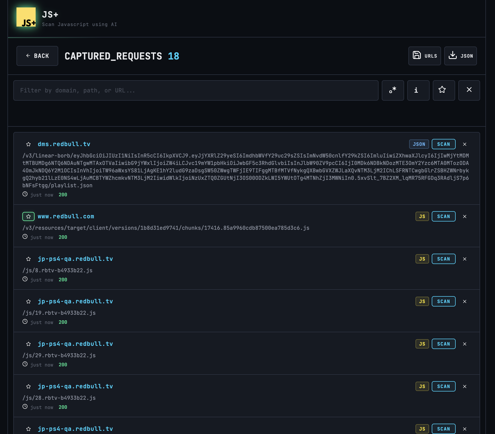
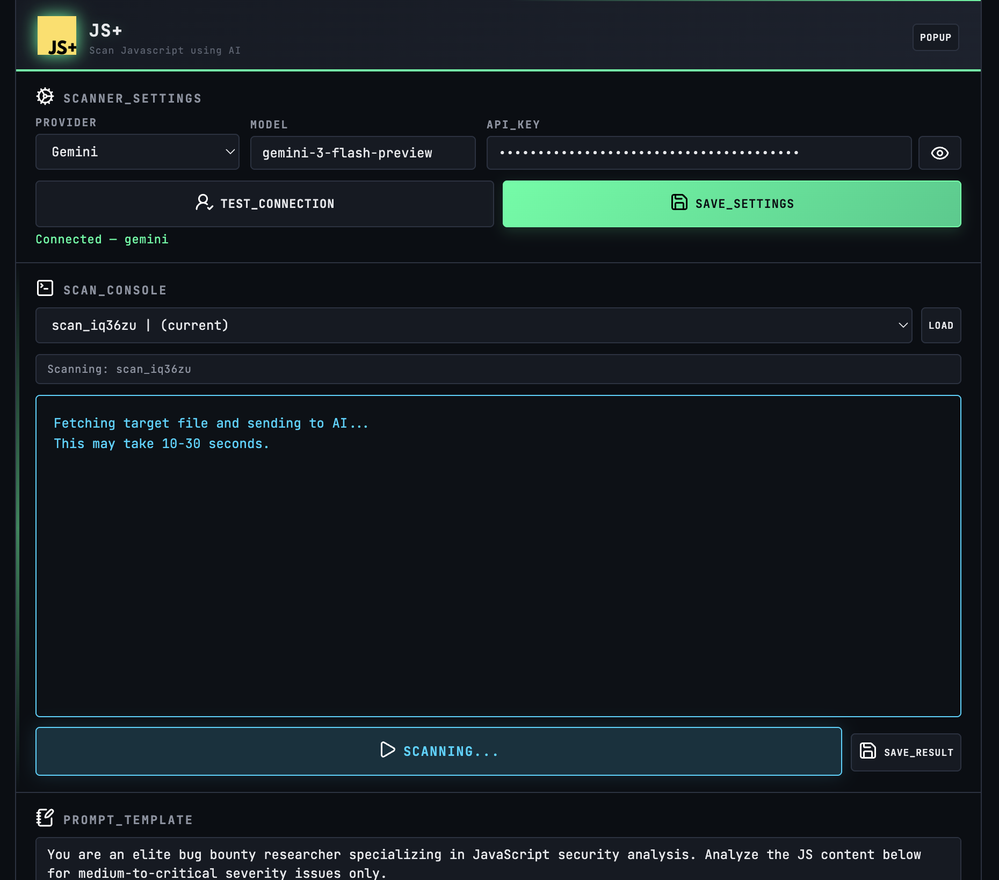
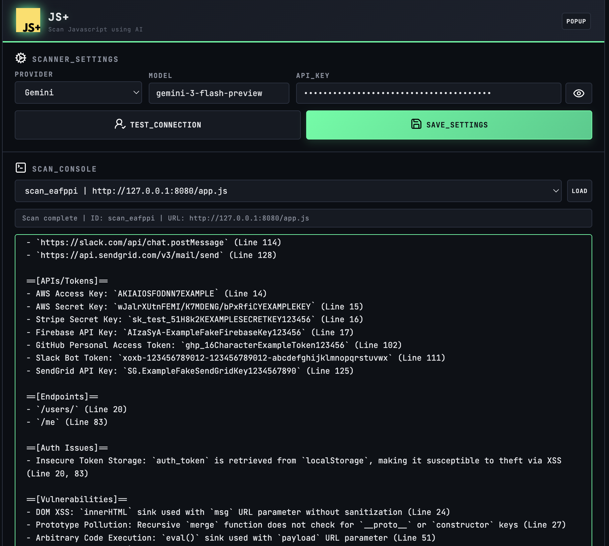
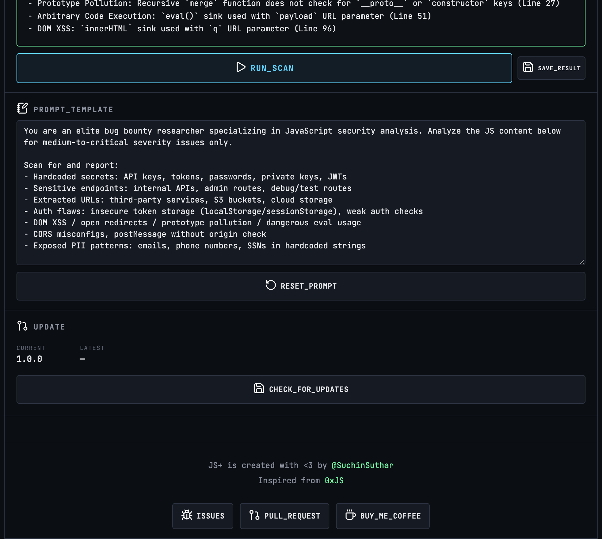

<p align="center">

</p>

<p align="center">
  Capture JavaScript requests and scan with AI models.
</p>

<p align="center">
  
  
  
  
  
</p>

🌐 Website: https://suchinsuthar.github.io/JSplus-ext/

A powerful Chrome extension that intercepts and analyzes JavaScript requests using AI models. Designed for security researchers and bug bounty hunters to identify potential vulnerabilities in web applications.

## 🎯 Features

### Core Functionality
- **🎯 Target Domain Filtering** - Monitor specific domains with wildcard support (`*.target.*`, `*.target.com`)
- **📡 Real-time Request Interception** - Capture all JS/JSX/TS/TSX/JSON requests
- **🔍 Advanced Filtering** - Search by domain, path, or URL with regex support
- **⭐ Favorites** - Mark important requests for quick access
- **📋 Export Options** - Export captured requests as JSON or URLs only

### AI-Powered Analysis
- **🤖 Multi-Model Support**
  - Google Gemini
  - OpenAI ChatGPT
  - Anthropic Claude
  - DeepSeek
- **🔐 Security Analysis** - AI-powered vulnerability detection in JavaScript files
- **💾 Persistent Results** - Store and revisit scan results without re-scanning
- **📊 Detailed Reports** - View scan results with history

### Advanced Features
- **🔄 Real-time Monitoring** - Toggle monitoring on/off with status indicator
- **🗑️ Smart Clearing** - Clear captured requests while preserving scan history
- **📱 Full-Page View** - Dedicated page for extensive request management
- **🔗 Inline Scanning** - Scan requests directly from the popup
- **⚙️ Custom Prompts** - Customize AI analysis prompts for your needs
- **🚀 Auto-Update Detection** - GitHub Releases API integration for version checking

## 📦 Installation

### From Chrome Web Store
*(Not available now, upcoming)*

### Manual Installation
1. Download the latest version from [Releases](https://github.com/suchinsuthar/JSplus-ext/releases)
1. **Clone or download** this repository
2. Open Chrome and navigate to `chrome://extensions/`
3. Enable **Developer Mode** (toggle in top-right)
4. Click **Load unpacked**
5. Select the extension folder
6. Pin the extension for easy access

## Screenshots



## 🚀 Quick Start

### 1. Configure Target Domains
- Click the **JS+** extension icon
- Add target patterns: `*.target.*`, `*.target.com`
- Use wildcards for flexible matching

### 2. Start Monitoring
- Click **START_MONITORING**
- Watch the status badge turn green (ONLINE)
- Extension will capture matching requests

### 3. View & Filter Requests
- Use search/filter for specific URLs  
**Filter Options**   
`.*` - Toggle regex mode  
`i` - Invert search results  
`★` - Show favorites only  
`✕` - Clear filter

### 4. Scan with AI
- Click **SCAN** on any request
- Go to **Settings** page
- Select AI provider and set API key
- View detailed analysis results

## ⚙️ Configuration

### API Key Setup

#### Google Gemini
1. Get API key: https://aistudio.google.com/app/apikey
2. Paste in `Settings > SCANNER_SETTINGS > API_KEY`
3. Default model: `gemini-3-flash-preview`

#### OpenAI ChatGPT
1. Get API key: https://platform.openai.com/api-keys
2. Paste in Settings
3. Default model: `gpt-4o`

#### Anthropic Claude
1. Get API key: https://console.anthropic.com/account/keys
2. Paste in Settings
3. Default model: `claude-3-5-sonnet`

#### DeepSeek
1. Get API key: https://platform.deepseek.com/api-keys
2. Paste in Settings
3. Default model: `deepseek-coder`

## 📤 Export Formats

### JSON Export
```json
{
  "exportDate": "2025-03-05T10:30:00.000Z",
  "targetPatterns": ["*.api.example.com"],
  "totalRequests": 42,
  "requests": [
    {
      "id": "scan_abc123",
      "url": "https://api.example.com/data.js",
      "domain": "api.example.com",
      "path": "/data.js",
      "type": "xhr",
      "statusCode": 200,
      "timestamp": 1725461400000
    }
  ]
}
```

### URLs Export
```
https://api.example.com/data.js
https://cdn.example.com/app.min.js
https://api.example.com/config.json
```

## 🔐 Security & Privacy

- **Local Storage Only** - No data sent to external servers except AI provider
- **API Keys** - Stored locally, never transmitted elsewhere
- **Scan Results** - Preserved indefinitely in local storage
- **No Tracking** - Zero analytics or tracking implemented

## 🤝 Contributing

We welcome contributions! Here's how to help:

1. **Report Issues** - Found a bug? [Open an issue](https://github.com/suchinsuthar/JSplus-ext/issues)
2. **Submit PRs** - Have improvements? [Create a pull request](https://github.com/suchinsuthar/JSplus-ext/pulls)
3. **Feature Requests** - Suggest new features via issues

## 📄 License

MIT License - Feel free to use, modify, and distribute.

## ☕ Support
- JS+ is created with <3 by [@SuchinSuthar](https://github.com/suchinsuthar) Inspired by [0xJS](https://github.com/4osp3l/0xJS)

If this tool helped you find vulnerabilities or saves time in your security work, consider supporting the development:  
[Buy Me a Coffee](https://buymeacoffee.com/suchinsuthar) | [Star this repo]()

---

**Happy hunting! 🎯**

*Disclaimer: This tool is for authorized security testing and bug bounty purposes only. Unauthorized access to computer systems is illegal.*
